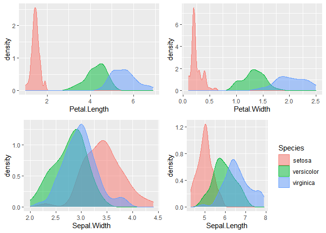
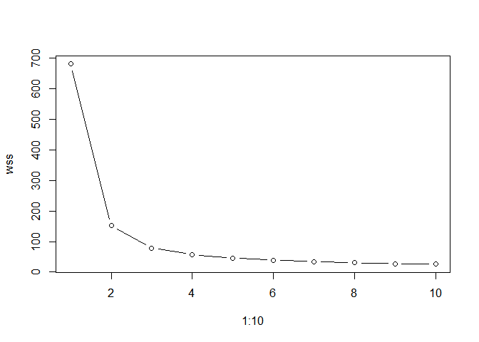
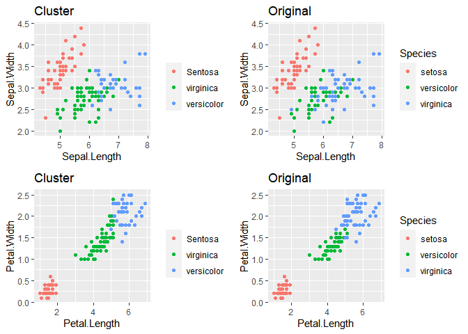

# The Sparks Foundation - Data Science and Business Analytics 
### Task#2 : Prediction using Unsupervised Machine Learning 
### Problem Statement: From the given ‘Iris’ dataset, predict the optimum number of clusters and represent it visually.
**Importing necessary libraries**

```r
library(ggplot2)
library(gridExtra)
```
  
**Downloading and viewing Data**

```r
# data is readily available in RStudio "datasets" package
data(iris)
summary(iris)
```

```
##   Sepal.Length    Sepal.Width     Petal.Length    Petal.Width   
##  Min.   :4.300   Min.   :2.000   Min.   :1.000   Min.   :0.100  
##  1st Qu.:5.100   1st Qu.:2.800   1st Qu.:1.600   1st Qu.:0.300  
##  Median :5.800   Median :3.000   Median :4.350   Median :1.300  
##  Mean   :5.843   Mean   :3.057   Mean   :3.758   Mean   :1.199  
##  3rd Qu.:6.400   3rd Qu.:3.300   3rd Qu.:5.100   3rd Qu.:1.800  
##  Max.   :7.900   Max.   :4.400   Max.   :6.900   Max.   :2.500  
##        Species  
##  setosa    :50  
##  versicolor:50  
##  virginica :50  
##                 
##                 
## 
```

```r
head(iris)
```

```
##   Sepal.Length Sepal.Width Petal.Length Petal.Width Species
## 1          5.1         3.5          1.4         0.2  setosa
## 2          4.9         3.0          1.4         0.2  setosa
## 3          4.7         3.2          1.3         0.2  setosa
## 4          4.6         3.1          1.5         0.2  setosa
## 5          5.0         3.6          1.4         0.2  setosa
## 6          5.4         3.9          1.7         0.4  setosa
```

```r
dim(iris)
```

```
## [1] 150   5
```
  
iris consist of 150 rows 5 columns    
**Preprocessing Data**

```r
is.null(iris)
```

```
## [1] FALSE
```

```r
any(is.na(iris))
```

```
## [1] FALSE
```

```r
data<-iris[,1:4]
species<-iris[,5]
head(data)
```

```
##   Sepal.Length Sepal.Width Petal.Length Petal.Width
## 1          5.1         3.5          1.4         0.2
## 2          4.9         3.0          1.4         0.2
## 3          4.7         3.2          1.3         0.2
## 4          4.6         3.1          1.5         0.2
## 5          5.0         3.6          1.4         0.2
## 6          5.4         3.9          1.7         0.4
```

```r
table(species)
```

```
## species
##     setosa versicolor  virginica 
##         50         50         50
```
  
iris is clean ie no null or na values .   
data is subset of iris with only needed columns.   
species shows original cluster having 50 values each.        
**Visualizing Data using Density Plot**

```r
plot1 <-    ggplot(iris, aes(x=Petal.Length, colour=Species, fill=Species)) +
  geom_density(alpha=0.5) +
  theme(legend.position="none")
plot2<- ggplot(iris, aes(x=Petal.Width, colour=Species, fill=Species)) +
  geom_density(alpha=0.5) +
  theme(legend.position="none")
plot3 <- ggplot(iris, aes(x=Sepal.Width, colour=Species, fill=Species)) +
  geom_density(alpha=0.5) +
  theme(legend.position="none")
plot4 <- ggplot(iris, aes(x=Sepal.Length, colour=Species, fill=Species))+
  geom_density(alpha=0.5) 
# Plot all density plots together
grid.arrange(plot1,plot2 ,plot3 ,plot4,nrow = 2
)
```

<!-- -->
  
**Clustering Data using K-Means**   
k should be 3 because there are 3 different species    
Verifying using elbow method 

```r
wss <- sapply(1:10,function(k){kmeans(data, k, nstart=50,iter.max = 10)$tot.withinss})
plot(1:10, wss,type = "b")
```

<!-- -->
    
   Verified k=3

```r
set.seed(120)
k3<-kmeans(data,3)
k3
```

```
## K-means clustering with 3 clusters of sizes 50, 62, 38
## 
## Cluster means:
##   Sepal.Length Sepal.Width Petal.Length Petal.Width
## 1     5.006000    3.428000     1.462000    0.246000
## 2     5.901613    2.748387     4.393548    1.433871
## 3     6.850000    3.073684     5.742105    2.071053
## 
## Clustering vector:
##   [1] 1 1 1 1 1 1 1 1 1 1 1 1 1 1 1 1 1 1 1 1 1 1 1 1 1 1 1 1 1 1 1 1 1 1 1 1 1
##  [38] 1 1 1 1 1 1 1 1 1 1 1 1 1 2 2 3 2 2 2 2 2 2 2 2 2 2 2 2 2 2 2 2 2 2 2 2 2
##  [75] 2 2 2 3 2 2 2 2 2 2 2 2 2 2 2 2 2 2 2 2 2 2 2 2 2 2 3 2 3 3 3 3 2 3 3 3 3
## [112] 3 3 2 2 3 3 3 3 2 3 2 3 2 3 3 2 2 3 3 3 3 3 2 3 3 3 3 2 3 3 3 2 3 3 3 2 3
## [149] 3 2
## 
## Within cluster sum of squares by cluster:
## [1] 15.15100 39.82097 23.87947
##  (between_SS / total_SS =  88.4 %)
## 
## Available components:
## 
## [1] "cluster"      "centers"      "totss"        "withinss"     "tot.withinss"
## [6] "betweenss"    "size"         "iter"         "ifault"
```

```r
#Comparing the predicted clusters with the original Clusters.
table(k3$cluster, iris$Species)
```

```
##    
##     setosa versicolor virginica
##   1     50          0         0
##   2      0         48        14
##   3      0          2        36
```
  
**Visualizing result**

```r
plota<-ggplot(iris, aes(x = Sepal.Length , y = Sepal.Width)) + 
  geom_point(aes(color = as.factor(k3$cluster))) +
  scale_color_discrete(name = " ", breaks=c("1", "2", "3"),labels=c("Sentosa", "virginica","versicolor")) +
  ggtitle("Cluster")
plotb<-ggplot(data=iris, aes(x =Sepal.Length , y = Sepal.Width)) +
  geom_point(aes(color=Species)) +
  ggtitle("Original")
plotc<-ggplot(iris, aes(x = Petal.Length , y = Petal.Width)) + 
  geom_point(aes(color = as.factor(k3$cluster))) +
  scale_color_discrete(name = " ", breaks=c("1", "2", "3"),labels=c("Sentosa", "virginica","versicolor")) +
  ggtitle("Cluster")
plotd<-ggplot(data=iris, aes(x =Petal.Length , y = Petal.Width)) +
  geom_point(aes(color=Species)) +
  ggtitle("Original")
grid.arrange(plota,plotb,plotc,plotd,nrow=2)
```

<!-- -->
  
The plots are almost similar except for a few outliers.
  
# Thank You
